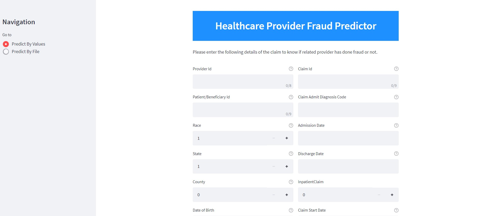

# Healthcare_Provider_Fraud_Detection
Predict Fraudulent Health Care Providers

### Application Demo 

### Using
  1. Python 
  2. Streamlit
  3. Heroku Cloud

### Link to access application demo: https://fraud-provider-predictor.herokuapp.com/

### Single Entity Prediction

### Bulk records(Inputs in CSV) Prediction 

(Please use reference file - **df_test.csv** for the order/format of column values need to be predicted in Bulk)
